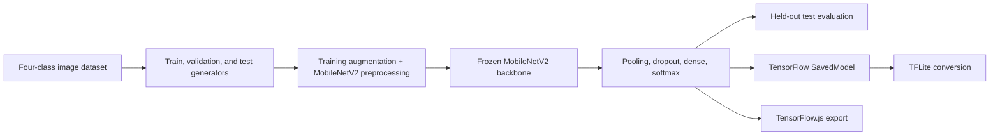

# Vehicle image classification with MobileNetV2

[](https://www.python.org/)
[](https://www.tensorflow.org/)
[](LICENSE)

Four-class vehicle image classifier built with a frozen ImageNet-pretrained MobileNetV2 backbone and exported to SavedModel, TensorFlow Lite, and TensorFlow.js formats.

## Scope

The notebook classifies images into:

- `bus`
- `car`
- `motorcycle`
- `truck`

It uses MobileNetV2 as a frozen feature extractor, followed by global average pooling, dropout, a 128-unit dense layer, and a four-class softmax output. The current notebook does not unfreeze the backbone for a separate fine-tuning stage.

## Workflow



## Evaluation evidence

The saved notebook output records:

| Split/output | Accuracy |
| --- | ---: |
| Final training epoch | 96.46% |
| Final validation epoch | 94.77% |
| Held-out test generator | 93.46% |

These figures are outputs from the included notebook and dataset split. They are not an external benchmark and do not establish performance on arbitrary real-world vehicle imagery.

## Exported artifacts

```text
model/saved_model/          TensorFlow SavedModel
model/tflite/model.tflite   TensorFlow Lite flatbuffer
model/tflite/label.txt      class labels
model/tfjs_model/           TensorFlow.js graph and weight shards
```

The notebook calls `TFLiteConverter.from_saved_model(...)` without setting an optimization or representative-dataset policy. The TFLite artifact is therefore described as converted, not quantized.

## Visual evidence

| Dataset distribution | Training curves | Confusion matrix | Predictions |
| --- | --- | --- | --- |
|  |  |  |  |

## Repository structure

```text
dataset/       small checked-in sample set for the four classes
images/        evaluation plots and prediction examples
model/         SavedModel, TFLite, labels, and TensorFlow.js artifacts
notebook/      training, evaluation, conversion, and inference notebook
requirements.txt
```

## Run locally

```bash
git clone https://github.com/RaihanHadriansyah21/vehicle-image-classification-mobileNetV2.git
cd vehicle-image-classification-mobileNetV2
python -m venv .venv
```

Activate the environment, then install and start Jupyter:

```bash
python -m pip install -r requirements.txt
jupyter notebook
```

Open `notebook/vehicle_image_classification.ipynb`. The complete training dataset used by the saved notebook is not fully included; `dataset/` contains representative samples.

## Status and limitations

Completed machine-learning notebook project. Limitations include a fixed dataset split, a frozen backbone, no probability-calibration analysis, and no packaged application consuming the exported models.

## License

Licensed under the [MIT License](LICENSE).
