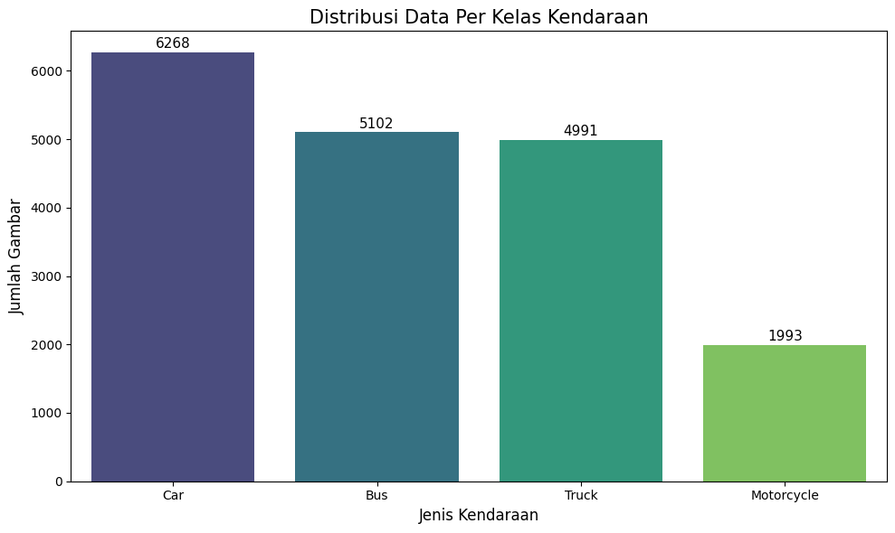
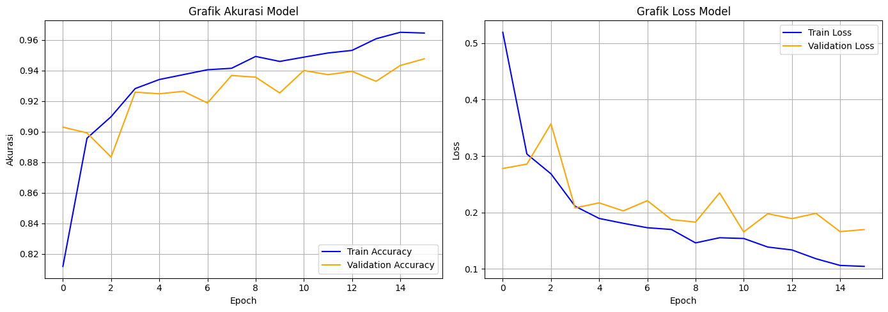
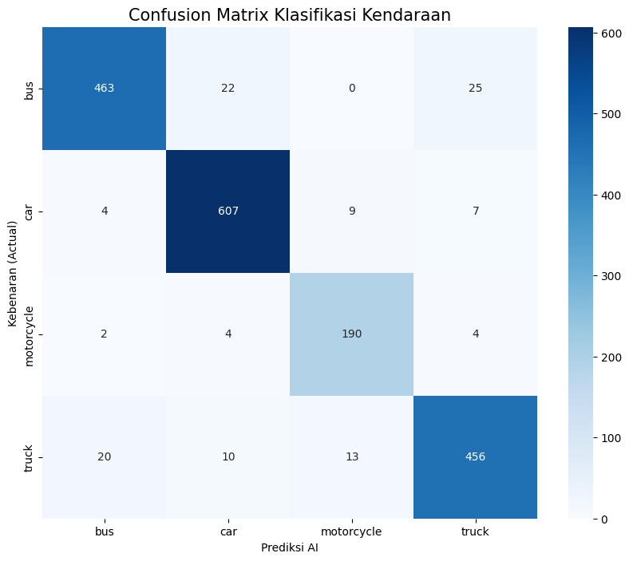
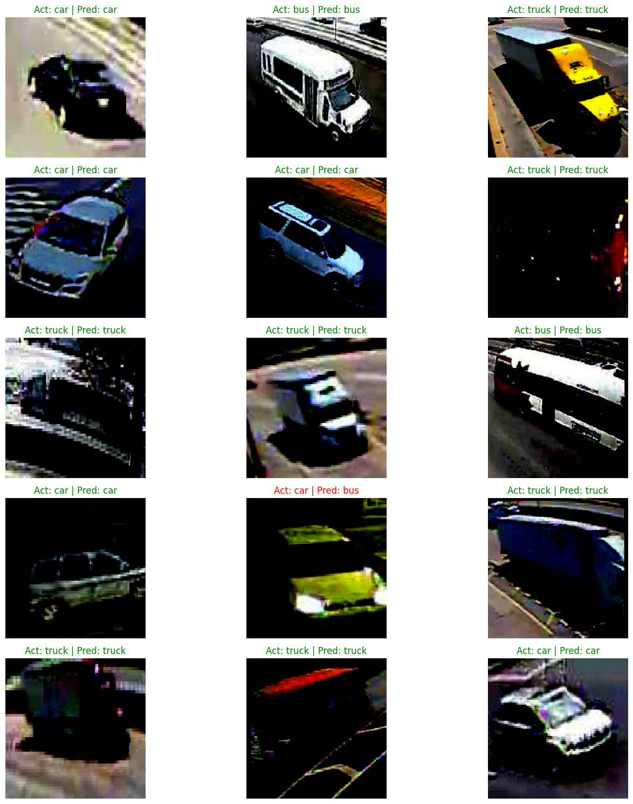

# Vehicle Image Classification using MobileNetV2 and TensorFlow

## Overview
This project focuses on vehicle image classification using Deep Learning and Transfer Learning approaches with MobileNetV2. The model is trained to classify four vehicle categories: car, bus, truck, and motorcycle.

The project covers the complete Computer Vision workflow including data preprocessing, augmentation, model training, evaluation, visualization, inference, and deployment-oriented model conversion.

---

## Features
- Vehicle image classification with Deep Learning
- Transfer Learning using MobileNetV2
- Data augmentation and preprocessing
- Model evaluation and visualization
- Real-time image inference simulation
- TensorFlow Lite model conversion
- TensorFlow.js model conversion
- SavedModel export for deployment purposes

---

## Dataset
The dataset contains approximately 18,354 vehicle images divided into four classes:
- Car
- Bus
- Truck
- Motorcycle

Only a small sample dataset is included in this repository for demonstration purposes.

### Dataset Source
[https://www.kaggle.com/datasets/yash88600/miotcd-dataset-50000-imagesclassification/data?select=train1](https://www.kaggle.com/datasets/yash88600/miotcd-dataset-50000-imagesclassification)

---

## Model Architecture

### Transfer Learning
- MobileNetV2 (ImageNet pretrained)

### Additional Layers
- Conv2D
- MaxPooling2D
- GlobalAveragePooling2D
- Dense Layer
- Dropout
- Softmax Output Layer

---

## Technologies & Libraries
- Python
- TensorFlow / Keras
- MobileNetV2
- Google Colab
- NumPy
- Pandas
- Matplotlib
- Scikit-learn
- PIL

---

## Project Structure

```bash
vehicle-image-classification-mobilenetv2/
│
├── dataset/
│   ├── sample_bus/
│   ├── sample_car/
│   ├── sample_motorcycle/
│   ├── sample_truck/
│   └── README.md
│
├── images/
│   ├── accuracy_loss_plot.png
│   ├── confusion_matrix.png
│   ├── dataset_distribution.png
│   ├── prediction_examples.png
│   └── README.md
│
├── model/
│   ├── saved_model/
│   ├── tfjs_model/
│   ├── tflite/
│   └── README.md
│
├── notebook/
│   ├── vehicle_image_classification.ipynb
│   └── README.md
│
├── README.md
├── LICENSE
└── .gitignore
```

---

## Data Visualization

### Dataset Distribution


---

### Training Accuracy & Loss


---

### Confusion Matrix


---

### Prediction Examples


---

## Model Evaluation
The model was evaluated using validation and test datasets to measure classification performance across all vehicle categories.

Evaluation includes:
- Accuracy
- Validation Loss
- Confusion Matrix Analysis
- Prediction Confidence Visualization

---

## Inference
The project includes image inference functionality where users can upload vehicle images and receive prediction results with confidence scores.

---

## Model Deployment Formats

The trained model was exported into multiple deployment-ready formats:

- TensorFlow SavedModel
- TensorFlow Lite (TFLite)
- TensorFlow.js (TFJS)

This enables future deployment for:
- Mobile applications
- Web applications
- Edge AI systems

---

## Future Improvements
- Implement advanced architectures such as EfficientNet or ResNet
- Add real-time webcam detection
- Deploy the model into a web application
- Improve model generalization with larger datasets
- Add object detection capabilities

---

## Author
**Mohammad Raihan Hadriansyah Prasetya**

Telecommunication Engineering Student  
AI & Machine Learning Enthusiast
