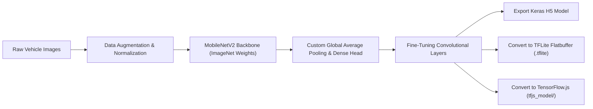

# Vehicle Image Classification with MobileNetV2 Transfer Learning

[](https://www.python.org/)
[](https://www.tensorflow.org/)
[](https://www.tensorflow.org/lite)
[](https://www.tensorflow.org/js)
[](LICENSE)

> Deep learning computer vision project utilizing MobileNetV2 transfer learning and fine-tuning for multi-class vehicle image classification, exported to TensorFlow Lite (TFLite) and TensorFlow.js formats.

---

## 📌 Overview

**Vehicle Image Classification MobileNetV2** is a computer vision project focused on lightweight multi-class image classification. Built with **TensorFlow** and **Keras**, the system leverages a pre-trained **MobileNetV2** backbone with custom classification heads and fine-tuning layers.

The model is optimized for edge deployment, exporting lightweight **TensorFlow Lite (`.tflite`)** flatbuffers for mobile applications and **TensorFlow.js (`tfjs_model/`)** artifacts for browser-based client-side inference.

---

## ✨ Key Features

- 🏎️ **Multi-Class Vehicle Classification**: Accurate classification across vehicle categories (e.g. cars, motorcycles, buses, trucks).
- 🧠 **Transfer Learning & Fine-Tuning**: Pre-trained ImageNet MobileNetV2 feature extractor fine-tuned with un-frozen top convolutional layers.
- 🖼️ **Realtime Image Data Augmentation**: Random rotation, zoom, horizontal flip, and shear transformations to prevent overfitting.
- ⚡ **Multi-Format Model Exports**:
  - **Keras H5**: Uncompressed Keras model (`.h5`) for server-side evaluation.
  - **TFLite Flatbuffer**: Quantized TensorFlow Lite model (`.tflite`) for mobile runtime.
  - **TensorFlow.js**: Web-ready JSON & bin shards (`tfjs_model/`) for zero-latency client-side browser prediction.

---

## 🛠️ Tech Stack

**Language & Environment**
- Python 3.10+
- Jupyter Notebook

**Deep Learning & Computer Vision**
- TensorFlow 2.x / Keras
- MobileNetV2 (ImageNet Pre-Trained Backbone)
- OpenCV & Pillow

**Edge Export Converters**
- TensorFlow Lite Converter (`tf.lite.TFLiteConverter`)
- TensorFlow.js Converter (`tensorflowjs_converter`)

---

## 🏗️ Model Training & Export Pipeline



---

## 📂 Project Structure

```text
vehicle-image-classification-mobileNetV2/
├── dataset/                  # Vehicle image dataset split (train, validation, test)
├── images/                   # Sample classification outputs & accuracy/loss plots
├── model/                    # Saved model artifacts (.h5, .tflite, tfjs_model/)
├── notebook/                 # Training, evaluation, and export notebook
├── requirements.txt          # Dependencies list
├── LICENSE                   # MIT License
└── README.md                 # Project Documentation
```

---

## 🚀 Getting Started

### Prerequisites
- Python 3.10 or higher
- Jupyter Notebook / JupyterLab

### Local Execution

1. **Clone the Repository**:
   ```bash
   git clone https://github.com/RaihanHadriansyah21/vehicle-image-classification-mobileNetV2.git
   cd vehicle-image-classification-mobileNetV2
   ```

2. **Create Virtual Environment**:
   ```bash
   python -m venv venv
   source venv/bin/activate  # On Windows: .\venv\Scripts\Activate.ps1
   ```

3. **Install Dependencies**:
   ```bash
   pip install tensorflow numpy matplotlib pillow tensorflowjs
   ```

4. **Launch Notebook**:
   ```bash
   jupyter notebook
   ```
   Open `notebook/` to execute model training, evaluation, and model conversion workflows.

---

## 📄 License

This repository is licensed under the [MIT License](LICENSE).
